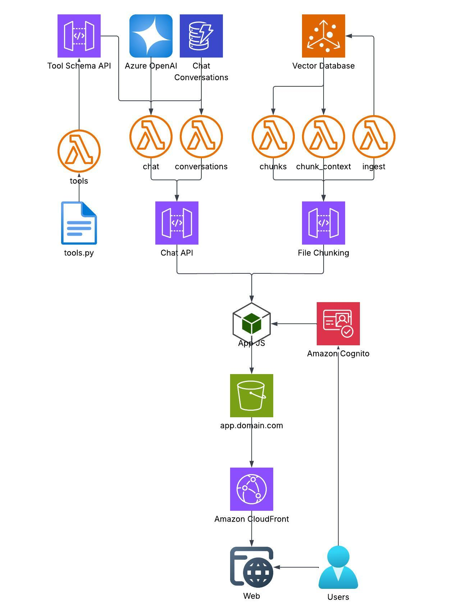

# Chat With Your Docs — AI FDE Assignment (Option 1)

A local-first RAG assistant: point it at your documents, then ask questions and
get answers grounded in your files — with visible tool use, live source
previews, and citations you can inspect.

> **A note on this README.** It is meant to be the majority-human piece — my
> thinking and trade-offs. Sections written by me are unmarked; sections that are
> primarily AI-generated (setup instructions, the productionisation sketch) are
> tagged **(AI GEN)**, so it's clear where my words end and the assistant's begin.

---

## Introduction and motivation

This repo is my implementation of the task (Option 1) in the
`Assignment - AI FDE.docx` file for the new role. I decided to choose Option 1
because I felt a good implementation of Option 1 should be able to encompass much
of Options 2 and 3. A good file-chat system should be able to help with code. It
should be able to help organise and create insights from meeting transcripts.

So while on the surface Option 1 may seem like the simplest task, I think it is
the most pivotal to all downstream tasks. Any modern AI SaaS system or product
usually requires a good RAG backbone.

So what do I think makes a good Option 1? A few things: **Observability, Clarity,
Choice, and Safety.**

### Observability
From the observability side, I think the chat should always display when a tool
has been used as part of an answer, along with details of the tool. I believe
model choice, ingested data, and data sources should always be visible. When a
response cites a document, I don't believe we should take it at face value — we
should be able to see, in real time, what part of which document informed the
answer we receive.

### Clarity
For clarity, I think a clean UI is important. I also think a certain level of
polish should be a minimum expectation — brand alignment, and simple quality
additions like rendering the LLM outputs with a markdown engine.

### Choice
We should be in control of what model we are using and what files are available
as context.

### Safety
The model should not be equipped with tools that write or overwrite system data.
For a file discussion and conversational tool, the agent's tools are read-only.

---

## Engineering approach

At a high level, I decided a JavaScript (React) web app hosted locally with a
FastAPI backend would be sufficient, along with integration to the OpenAI API.

It would have been possible to take alternative routes, such as using Python and
Tkinter — although system-bound design kits can vary in quality and consistency
depending on the user's system (Windows, Mac, Linux). Additionally, a React and
API-based solution is the most faithful analogue to what a cloud-native,
hyper-scaling solution would look like. I explore this more in the cloud
architecture section, where I include a naive cloud architecture diagram.

---

## Design decisions

For the vector store I chose **ChromaDB** because I'm familiar with it and it runs
locally without a server — it's lightweight and simple. I did review alternatives
but didn't go with any for this project; if we were implementing on AWS I would
have used **Amazon S3 Vectors** instead.

I chose the standard mini **sentence-transformers embedder** (`all-MiniLM-L6-v2`),
as it ships with `transformers`, is fast and lightweight, and can even run on CPU
if needed.

I decided **against Ollama** to avoid requiring the download of potentially heavy,
high-memory LLMs just to use this project. I use the **OpenAI API** and accept
that a few cents of token cost is fine for the assignment. Again, if we were on
AWS or Azure we could use **Bedrock** or **Azure AI Foundry**.

**FastAPI** I use as a standard default for Python. I picked **React** for the
frontend out of familiarity — **Next.js** would also have been a good choice.

_Alternatives I reviewed for the vector DB and OCR are written up in_
[docs/research/](docs/research/).

---

## Features

### Implemented
- **View sources, in real time** — every citation chip previews the exact chunk,
  highlighted inside its surrounding document text, on hover. A Documents drawer
  browses the whole corpus as a folder → file → chunk tree.
- **Markdown renderer** — assistant answers render as proper Markdown (headings,
  tables, lists, code blocks), safely (no raw HTML injection).
- **Model select** — choose the model from the header or Settings (GPT-5.6 Sol /
  Terra / Luna, with a GPT-4o-mini fallback), plus a reasoning-effort control.
- **Chunk file browser + delete** — see everything indexed; remove a single file's
  chunks or clear the whole index.
- **Tool-use transparency pips** — each answer shows which tools ran (semantic
  search, keyword search, read file) and their result counts.
- **Read-only agent** — the agent has no write/delete/overwrite tools by design.
- **Brand alignment** — built on the Newpage design system (tokens, components,
  logo), light/dark aware.
- **Key entered in the UI** — no key on disk required to start; it's held locally.

### Not yet implemented
- Commenting / notes on files _(designed for, didn't make the cut)_
- Speech-to-transcript (STT) input _(designed for, didn't make the cut)_
- LLM output streaming
- A backend events system
- Ollama / open-source local models (the `llm.py` seam is ready for it)
- Project areas / workspaces
- User accounts

---

## Supported inputs (ingestion)

Files are converted **directly** into chunks — no intermediate conversion step.
The pipeline currently ingests:

| Type | Extensions | How |
|---|---|---|
| Plain text & data | `.txt` `.md` `.rst` `.log` `.csv` `.tsv` `.json` | read as text |
| Source code | `.py` `.js` `.ts` `.jsx` `.tsx` `.java` `.c` `.cpp` `.h` `.cs` `.go` `.rs` `.rb` `.php` `.sh` `.sql` `.yaml` `.yml` `.toml` `.ini` `.xml` `.css` | read as text |
| HTML | `.html` `.htm` | parsed to text — **prose, tables, and SVG chart labels** (no browser/PDF export needed) |
| PDF | `.pdf` | embedded text layer; **scanned pages fall back to OCR**; embedded raster figures are OCR'd as sub-chunks |
| Images | `.png` `.jpg` `.jpeg` `.webp` `.bmp` `.tiff` `.gif` | **OCR** (EasyOCR on GPU, with RapidOCR / Tesseract fallbacks) |

Images — standalone or embedded inside HTML/PDF — are OCR'd into sub-chunks, so
image content is searchable too.

---

## Architecture at a glance (AI GEN)

```
Browser (React, :5173) ──HTTP──▶ FastAPI (:8000)
                                    │
                                agents.py — conversation state + tool-call loop
                                 │   │   │
                     llm.py ◀────┘   │   └──▶ registry.dispatch(name,args) ──▶ tools.py
                  (OpenAI only)      │                                          query_rag
                                     ▼                                          search_keyword
                             tool_schema.py — signatures → JSON schema          read_file
                                     │
   ingestion.py ─ extract (text / HTML / PDF+OCR / image OCR) ─▶ chunking ─▶ embeddings ─▶ Chroma
```

Details: [backend/README.md](backend/README.md) · design rationale & trade-offs:
[docs/PLAN_AUDIT.md](docs/PLAN_AUDIT.md) · tech research:
[docs/research/](docs/research/) · OCR evaluation: [docs/ocr-assessment.md](docs/ocr-assessment.md).

---

## Cloud architecture

A naive hyper-scaler productionisation of the app:



Short version: keep the API stateless and autoscaled, move ingestion
(OCR/embedding) onto an async queue + workers, use a managed vector DB and object
storage, and keep the single `llm.py` seam so the model provider stays swappable.
The full breakdown (what changes vs the local app) is in
[docs/cloud-architecture.md](docs/cloud-architecture.md).

---

## How I used AI

Any section of this README that is **not** tagged **(AI GEN)** is mine. The
Lucidchart AWS diagram is human-made, and the pseudocode is human-made. The
design decisions and trade-offs were human-determined. AI was used to implement
the pseudocode, create the design system, and build the frontend.

Debugging was largely an AI-driven exercise: I often take a few moments to note
all the potential bugs, features, flaws and observations, then comment back a
targeted set of fixes or improvements for another round of iteration.

---

## Setup & usage (AI GEN)

### Prerequisites
- **Node.js** 18+ and npm (frontend)
- **Python** 3.11+ (backend)
- An **OpenAI API key** — entered in the UI (no need to put it on disk to start)
- Optional: an NVIDIA GPU speeds up OCR/embeddings; CPU works too.

### 1. Backend
```bash
cd backend
python -m venv .venv
.venv\Scripts\activate            # Windows
# source .venv/bin/activate         # macOS / Linux
pip install -r requirements.txt
uvicorn app.main:app --reload       # http://localhost:8000  (docs at /docs)
```
> First ingest downloads the embedding model (~90 MB) and, if OCR runs, the
> EasyOCR models. You don't need a `.env` — the API key can be entered in the UI
> (it's then saved to a gitignored `backend/.env` so it survives restarts).

### 2. Frontend
```bash
cd frontend
npm install
npm run dev                         # http://localhost:5173
```
Point it at a different backend with `VITE_API_URL` (see `frontend/.env.example`).

### 3. Using the app
1. Open **http://localhost:5173**.
2. Click **API key**, paste your OpenAI key, Save → the badge flips to **Ready**.
   Pick a model there or from the header dropdown.
3. In the ingest bar, **Browse…** to a file or folder (toggle **Subfolders** to
   include nested files), then **Ingest**.
4. Ask a question. Answers show the **tools the agent ran**, and **citation
   chips** you can hover to see the exact source passage. Open **Documents** to
   browse or delete indexed chunks.

### Tests
```bash
cd backend
python -m unittest discover -s tests -v     # or: pytest
```

---

## Repo layout
```
frontend/      React + TypeScript app (Vite) + the Newpage design system
backend/       FastAPI app, RAG pipeline, tool registry + schema generation, tests
docs/          plan audit, research, OCR assessment, cloud architecture
pseudocode/    the original architecture sketches this implements
```
